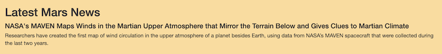
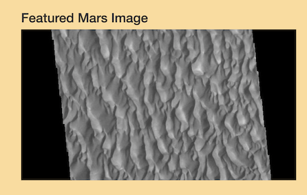
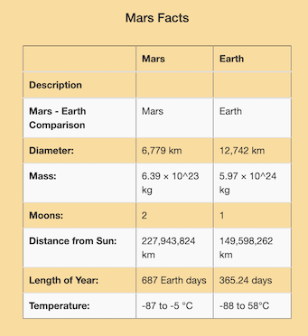
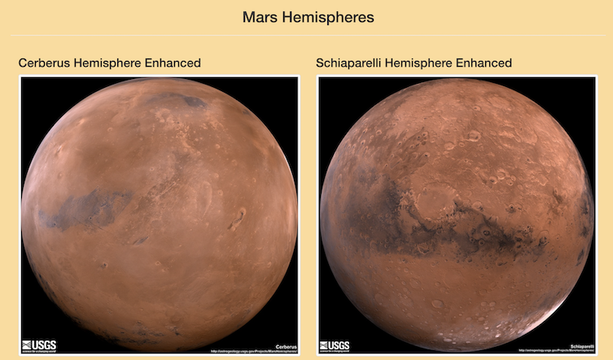
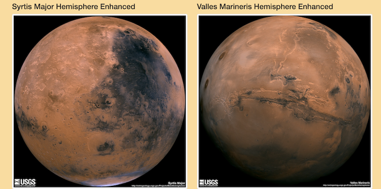

# Mission-to-Mars

Web scraping with HTML/CSS

## Project Overview

The purpose of this project is to build an application that performs Data Scraping by clicking on a button, which will display information about Planet Mars gathered from different websites.

## Web Scraping Methods

- Chrome Developer Tools were used to identify HTML components.

- Python script was written using Splinter to automate the browser.

- BeautifulSoup, another Python library, was used to extract the data. 

- The NoSQL database MongoDB was used to store the scraped data.

- Flask was used to create the Mission to Mars web application, containing a button that executes the scraping code and updates the page with newest data.

- HTML and CSS were used to customize the web application.

- Bootstrap was used to give the web application extra polish.

### **Automated Button**

### **Mars News**

### **Featured Mars Image** 

### **Mars Facts**

### **Mars Hemispheres Images**

### **Styling the Web Application**

A few extra modifications were done at the end of the project using a Bootstrap stylesheet and also some inline CSS as well.

- Using Bootstrap stylesheet:

    - Color of the Scrape Button was changed from blue to white.
    - Mars facts table was modified to be "table responsive" so it would adjust according to the size of the screen of the device been used - (the other sections were already altered to be responsive earlier on the project).
    - Mars Facts Table was styled to have outer borders and color alternating rows by adding **class="table table-bordered table-striped"** inside its table tag.
    - Mars Facts title was adjusted to be centered by adding **class="text-center"** inside its opening heading tag.

- Using Inline CSS:

    - The page's background color was modified to light orange, by adding **style= "background-color:rgba(255, 166, 0, 0.404)"** to the opening body tag.
    - The Jumbotron's background color was changed to orange, by adding **style="background-color:orange"** to the Jumbotron's opening div tag.
    - The Scrape Button's text color was changed to orange, by adding **style="color:orange"** to the Jumbotron's opening **a** tag, where the button is created.

